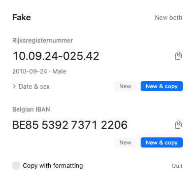

# Fake

A native macOS menu bar app for generating plausible Belgian test values.



[Dark appearance](docs/preview-dark.png)

- **Rijksregisternummer:** a valid birth date, male/female sequence parity, and the correct MOD 97 checksum (including the 2000+ rule). Shows the encoded date and sex.
- **Belgian IBAN:** 16 characters, a valid domestic account checksum, and the international MOD 97 checksum.

Values are synthesized locally, without looking up people or bank accounts. **A valid format cannot guarantee a number is unassigned.** Use these values only as test data. The IBAN generator uses bank prefix `539` from SWIFT's Belgian example with a random seven-digit account body; it excludes the published example account.

## Development

Requires macOS 14+ and Swift 6+ (Xcode or Command Line Tools). No dependencies.

```sh
./scripts/run.sh       # Build Fake.app and open its menu bar popover
./scripts/test.sh
make smoke             # Run the native app and integration checks, then quit
```

The standalone app is built at `build/Fake.app`. Drag it into Applications if desired. It has no Dock icon; click “fake” in the menu bar. The local build is ad-hoc signed, without requiring an Apple developer account. It is not notarized for public distribution.

Click either value to copy it. Each section has **New** and **New & copy** buttons. Expand **Date & sex** for a fixed birthday or encoded sex. Changes immediately generate a matching number. By default, copies are compact; **Copy with formatting** preserves the displayed punctuation and spacing, and is remembered between launches.

Keyboard shortcuts while the popover is open:

| Action | Shortcut |
| --- | --- |
| New rijksregisternummer / IBAN | ⌘1 / ⌘2 |
| New & copy rijksregisternummer / IBAN | ⇧⌘1 / ⇧⌘2 |
| Copy rijksregisternummer / IBAN | ⌘C / ⇧⌘C |
| New both | ⌘R |
| Quit | ⌘Q |

Press Escape or click outside to dismiss. Values stay available until regenerated or the app quits. The app runs offline and does not retain generated values between launches.

Tests include official reference examples, century and leap-day cases, malformed inputs, the domestic zero-remainder case, and 10,000 generated pairs checked with independent arithmetic.

`make smoke` opens and closes the actual menu bar popover, checks its expansion/collapse sizing, custom date/sex, regeneration, compact/formatted clipboard output using a private pasteboard, and keyboard handling.

For visual QA, `./build/Fake.app/Contents/MacOS/Fake --preview` opens the same content in a stable window. The normal app remains a menu bar utility. To render the app's own view as a PNG:

```sh
./build/Fake.app/Contents/MacOS/Fake --render-preview build/preview.png
./build/Fake.app/Contents/MacOS/Fake --render-preview build/preview-dark.png --customized --dark
```

## Format references

- [IBZ: IT 000, Rijksregisternummer](https://www.ibz.rrn.fgov.be/sites/default/files/documents/nl/rijksregister/onderrichtingen/IT-lijst/IT000_Rijksregisternummer.pdf): birth date + series (001–997 odd for male; 002–998 even for female) + `97 − (body mod 97)`. Prefix the checksum body with `2` for births from 2000.
- [SWIFT IBAN Registry](https://www.swift.com/fr/swift-resource/9606/download): Belgium `BE` + two check digits + 12-digit BBAN; printed in groups of four.
- [Febelfin: Belgian domestic checksum and planned 2029 bank-code change](https://febelfin.be/en/themes/digitalization-innovation/digital-payments-online-banking-for-enterprises/the-belgian-banking-sector-will-migrate-to-alphanumeric-bank-identification-codes-in-2029): the first ten BBAN digits modulo 97, replacing zero with 97. Fake generates the current numeric format.
- [Febelfin: IBAN calculation](https://febelfin.be/media/pages/publicaties/2023/febelfin-standaarden-voor-afstandsbankieren/cc812e7fba-1694763196/febelfin-standard-credit-transfer-xml-2023-v1.0-en_1.pdf): move the country code and check digits to the end, convert letters to numbers, and require remainder 1 modulo 97.

This generator handles complete Gregorian dates in 1900–2099. It does not generate BIS numbers or registry numbers with unknown birth dates.
